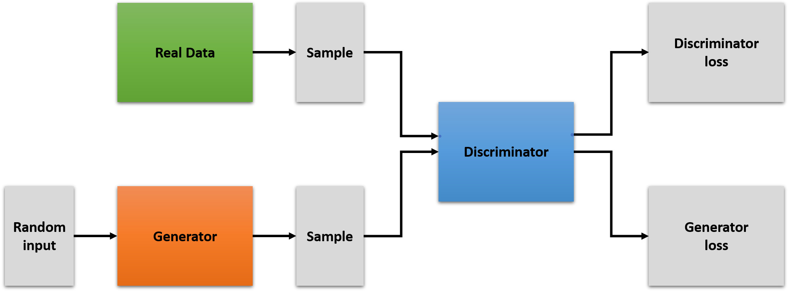

# Artificial Data Generation using GANs

## 1. GAN - Generative Adversarial Networks

An excellant and more detailed read on GANs: [Google Developers](https://developers.google.com/machine-learning/gan)

### 1.1 GAN Structure

A GAN consists of 2 parts - a generator and a discriminator, both neural networks which try to compete with each other.

* The Generator tries to generate content which is ideally supposed to look like the real content, which can be image, text, a just numerical data in general.
    * The generator is penalised if the discriminator is able to distinguish between real and generated content

* The discriminator tries to tell apart the generated content and the real content
    * The discriminator is penalised if it's not able to distinguish between real and generated content

### 1.2 GAN Training

* Discriminator
    * Tries to **classify** real data from generated one
    * Discriminator **loss** is calculated
    * **Gradients** of discriminator are 
    computed through backpropagation based on discriminator's loss
    * Computed gradients used to change discriminator's **weights**

* Generator
    * **Produce output** based on random input
    * Discriminator tries to **classify** this output as real or fake
    * **Generator loss** is calculated based on discriminator's classification efforts
    * **Gradients** of generator are 
    computed through backpropagation based on generator's loss
    * Computed gradients used to change generator's **weights**

